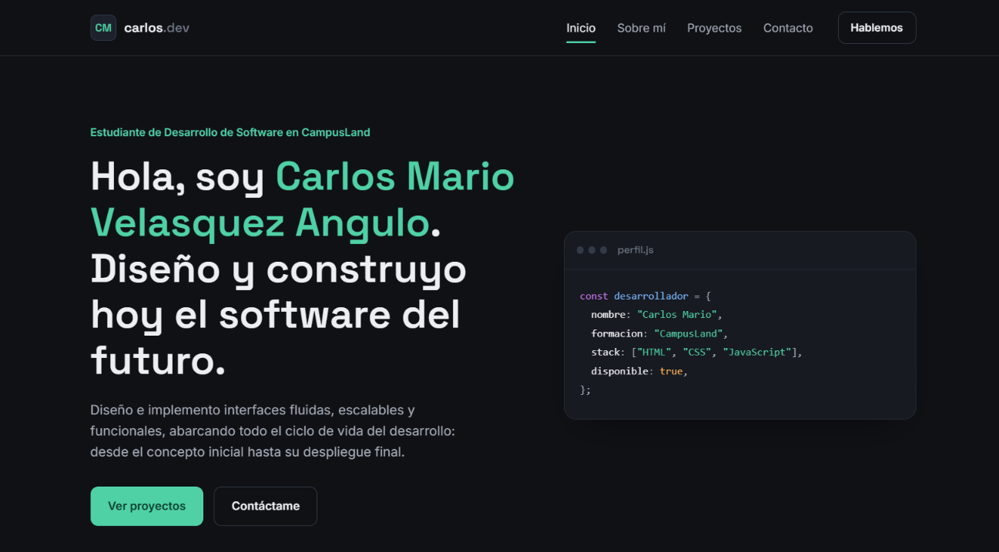
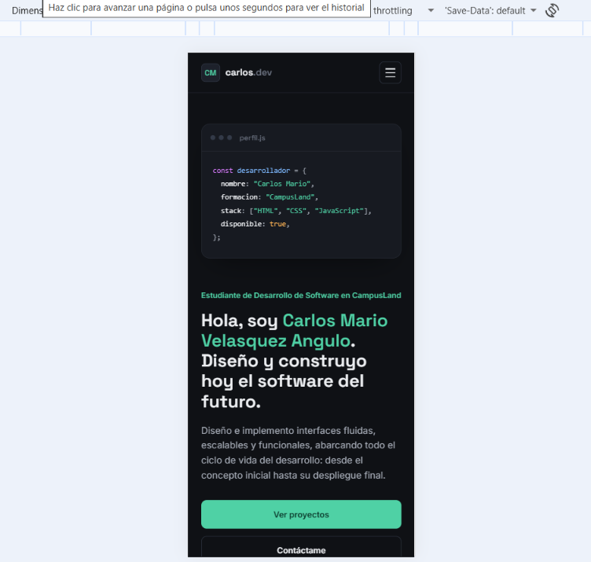

# ⚡ Portafolio Digital — Carlos Velásquez
> *Construyendo la arquitectura web del mañana con rendimiento extremo y código limpio.*

<div align="center">


[](https://github.com/carlosmariov98-hue/PortafolioCarlosVelasquez)

</div>

---

## 🛸 Visión General

Este repositorio aloja la interfaz de mi **Portafolio Digital**: una Single-Page Application (SPA) nativa diseñada como mi hub de presentación técnica. El proyecto fue concebido bajo el paradigma de **Rendimiento Máximo, Accesibilidad Universal y Semántica Estricta**, traduciendo lógica de diseño en un producto web ligero y de alto impacto.

---

## 📸 Vista Previa del Sistema(Monitor y Movil)

<div align="center">
  
  <br><br>
  
</div>

---

## ⚡ Especificaciones Técnicas y Capacidades

* **Diseño Ultra-Responsivo:** Arquitectura fluida implementada con **CSS Grid & Flexbox**, garantizando adaptación perfecta desde displays 4K hasta pantallas móviles.
* **Semántica Web y A11y:** Maquetación limpia basada en etiquetas HTML5 puras (`header`, `nav`, `main`, `section`, `footer`) enriquecida con atributos `aria-*` y navegación accesible por teclado.
* **Control de UI Dinámico:** Menú interactivo con interceptor de scroll (*ScrollSpy*) en vanilla JavaScript y menú hamburguesa optimizado para dispositivos táctiles.
* **Optimización de Recursos:** Zero dependencias pesadas, carga diferida de imágenes (`loading="lazy"`) en formatos WebP/SVG y consumo mínimo de memoria en renderizado.

---

## 🛠️ Stack Tecnológico

| Tecnología | Rol en la Arquitectura |
| :--- | :--- |
| **HTML5** | Estructura semántica, accesibilidad WAI-ARIA y SEO nativo |
| **CSS3** | Sistema de diseño, variables CSS, animaciones y maquetación responsive |
| **JavaScript (ES6+)** | Lógica de interacción, manipulaciones del DOM y navegación activa |
| **Google Fonts** | Tipografía técnica de alta legibilidad (*Space Grotesk / Inter*) |
| **GitHub Pages** | Infraestructura de despliegue continuo (CI/CD) |

---

## 📂 Arquitectura del Proyecto

```bash
Portafolio/
├── index.html          # Punto de entrada principal (DOM)
├── css/
│   └── styles.css      # Motor de estilos, tokens y responsive design
├── js/
│   └── main.js         # Lógica interactiva y manipulaciones
├── assets/
│   ├── favicon.svg     # Identificador visual vectorial
│   └── login admin.jpeg # Recursos visuales
└── README.md           # Documentación del sistema

⚡ Ejecución en Entorno Local
El proyecto se ejecuta en un entono web sin necesidad de compilar o instalar dependencias externas.

Clonar el repositorio:

Bash
git clone [https://github.com/carlosmariov98-hue/PortafolioCarlosVelasquez.git](https://github.com/carlosmariov98-hue/PortafolioCarlosVelasquez.git)
Acceder al directorio:

Bash
cd PortafolioCarlosVelasquez
Desplegar servidor local:

Bash
# Opción 1: Mediante npx
npx serve .

# Opción 2: Usar la extensión Live Server en VS Code
🚀 Despliegue e Infraestructura
El sitio se encuentra sincronizado con GitHub Pages desde la rama main.

🔗 Enlace a producción: https://carlosmariov98-hue.github.io/PortafolioCarlosVelasquez/

Configuración de despliegue:

Source: Branch: main | Folder: / (root)

📦 Proyectos Destacados en el Portafolio
EventosHub: Plataforma web completa diseñada para descubrir, publicar y gestionar eventos interactivos con interfaz responsiva y filtrado dinámico.

🌐 Conexión & Contacto
Desarrollado por Carlos Velásquez

Estudiante de Desarrollo de Software · CampusLands